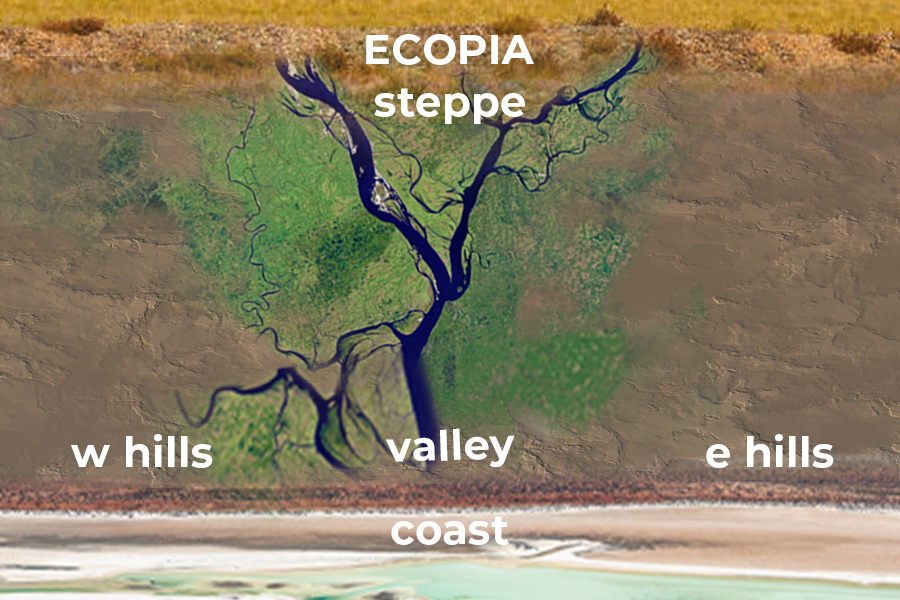

# [Ecopia]




## Description

Welcome to Ecopia! This is a game develop using java web development for a education usage. 

## Table of Contents

- [Features](#features)
- [Installation](#installation)
- [Usage](#usage)
- [Development](#development)
- [Contributing](#contributing)
- [License](#license)


## Features

- [List key features and functionalities of your game]

## Installation

1. **Clone the repository**
   ```bash
   git@github.com:BihangaNimhan/Ecopia_game.git

## Contributing

We welcome contributions to [Ecopia]! Follow these steps to contribute:

1. **Fork the repository**
   - Click on the "Fork" button at the top right corner of this page.

2. **Create a new branch**
   ```bash
   git checkout -b feature/awesome-feature

